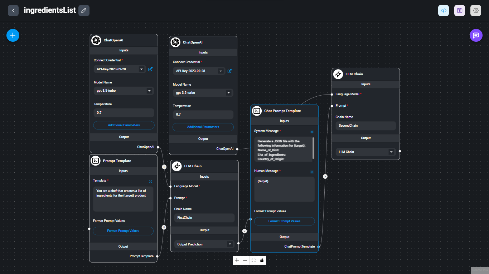
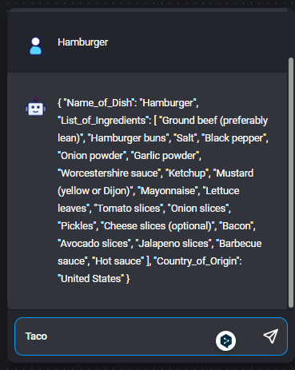
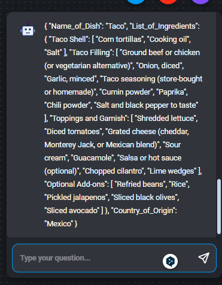
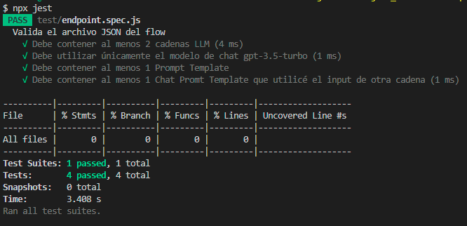

# De prompt a JSON

## Índice

- [1. Consideraciones generales](#1-consideraciones-generales)
- [2. Preámbulo](#2-preámbulo)
- [3. Resumen del proyecto](#3-resumen-del-proyecto)
- [4. Objetivos de aprendizaje](#4-objetivos-de-aprendizaje)
- [5. Criterios de aceptación](#5-criterios-de-aceptación)
- [6. Implementación paso a paso](#6-implementación-paso-a-paso)
- [7. Valida tu solución](#7-valida-tu-solución)
- [8. Recursos](#8-recursos)

## 1. Consideraciones generales
Este proyecto se realizó de manera individual.

## 2. Preámbulo

La Inteligencia Artificial Generativa (IA Generativa) es una rama de la IA que se centra en crear sistemas capaces de generar contenido nuevo y original, como imágenes, música o texto, imitando patrones y estilos previamente aprendidos. Esto es útil para automatizar procesos como generar copys, escribir correos electrónicos, analizar datos, entre otros.

En este proyecto, se aplicó el "Prompt Engineering", que es el proceso de diseñar y perfeccionar cuidadosamente las instrucciones o "prompts" que se utilizan para interactuar con un modelo de lenguaje AI como GPT-3.5. Se experimentó con diferentes preguntas o comandos para obtener respuestas precisas y útiles del modelo, ajustando la estructura, el tono y el formato del prompt para maximizar la efectividad de la comunicación con la IA.

## 3. Resumen del proyecto

Se aplicaron habilidades de prompting para crear una aplicación que aprovecha el encadenamiento de prompts para producir un resultado en formato JSON. Este chatflow toma el input del usuario y lo utiliza como parte de los prompts que creamos para generar información adicional útil para el usuario. Se ha utilizado la herramienta [Flowise](https://flowiseai.com/).

El tema y la utilidad de la aplicación es libre. En este proyecto, se tomó el nombre de un platillo gastronómico como input y, a través del prompting, se obtuvo los ingredientes que lo conforman y el país de origen del platillo, proporcionando esta información como un objeto en formato JSON.

## 4. Objetivos de aprendizaje

Con este proyecto se ha logrado familiarizar con los principales conceptos en torno a la [Inteligencia Artificial Generativa](https://es.wikipedia.org/wiki/Inteligencia_artificial_generativa) y hemos trabajado con [Flowise](https://docs.flowiseai.com/) para implementar soluciones AI a través de una API. Flowise es una herramienta basada en [LangChain](https://docs.langchain.com/docs/), por lo que hemos entendido los conceptos fundamentales de esta herramienta.

Se completaron los siguientes objetivos de aprendizaje:

- [x] [Flowise basics](https://www.youtube.com/watch?v=tD6fwQyUIJE&list=PL4HikwTaYE0HDOuXMm5sU6DH6_ZrHBLSJ)
- [x] [Langchain Components](https://docs.langchain.com/docs/category/components)
- [x] [Chat models](https://docs.flowiseai.com/chat-models)
- [x] [Estructuración de Datos](https://learnprompting.org/es/docs/basic_applications/table_generation)
- [x] [Cadenas](https://docs.langchain.com/docs/components/chains/)
- [x] [Prompts Templates](https://docs.langchain.com/docs/components/prompts/)

## 5. Criterios de aceptación

Para garantizar el éxito del proyecto, se tomaron los siguientes criterios de aceptación:
-Configurar tu chatflow de manera que tome el input del usuario y sea utilizado como parte de la cadena de prompts.
-Utilizar el módelo gpt-3.5-turbo.
-El chatbot generado debe ser capaz de generar respuestas en formato JSON.
-Los github actions deben pasar exitosamente.
-Se deben utilizar al menos lo siguientes nodos:
  LLM Chain
  Prompt Template
  Chat Prompt Template

## 6. Implementación Paso a Paso

A continuación, se describen los pasos que se siguieron para implementar este proyecto:

**Paso 1: Definición del Tema**
- Se eligió el tema y la utilidad de la aplicación. En este caso, la aplicación tomaría el nombre de un platillo gastronómico como input y proporcionaría los ingredientes y el país de origen del platillo en formato JSON como resultado.

**Paso 2: Instalación de Flowise**
- Se instaló flowise globalmente [Flowise](https://github.com/FlowiseAI/Flowise). Esto permitió utilizar la herramienta para crear y configurar nuestro chatflow.

**Paso 3: Creación del Chatflow**
- Se creo un chatflow que tomaría el input del usuario y lo utilizaría como parte de la cadena de prompts. Configurando los nodos necesarios, incluyendo LLM Chain, Prompt Template y Chat Prompt Template, para lograr el flujo de conversación deseado.

**Paso 4: Configuración del Modelo AI**
- Se eligió modelo AI adecuado para el proyecto, en este caso, el modelo `gpt-3.5-turbo`. Configurando el chatbot para que utilizara este modelo.

**Paso 5: Definición de Variables de Entorno**
- Se definió una variable de ambiente con el nombre `OPENAI_API_KEY` y se asignó el valor de una API key de OpenAI. Permitiendo así, utilizar los servicios de OpenAI.

**Paso 6: Pruebas y Validación**
- Antes de finalizar, se realizaron pruebas exhaustivas para asegurar que el chatbot generaba respuestas en formato JSON de manera correcta. 

- Una vez que la aplicación estuvo funcionando correctamente, se utilizó tanto a través de la interfaz de usuario proporcionada por Flowise como mediante peticiones HTTP para verificar su funcionamiento en un entorno real.

**Paso 7: Uso de la Herramienta**
Se corrieron los test de forma local y también se revisó que las GitHub Actions pasaran exitosamente para garantizar la continuidad del proyecto.

## 8. Recursos

- [Serie de tutoriales en youtube (inglés)](https://www.youtube.com/watch?v=tD6fwQyUIJE&list=PL4HikwTaYE0HDOuXMm5sU6DH6_ZrHBLSJ)
- [Introducción a Ingenieria de Prompting](https://learnprompting.org/es/docs/basics/prompting)
- [Encadenamiento de Prompts](https://botpress.com/es/blog/what-is-ai-prompt-chaining#:~:text=Permite%20crear%20respuestas%20personalizadas%20basadas,mejora%20el%20compromiso%20del%20usuario.)